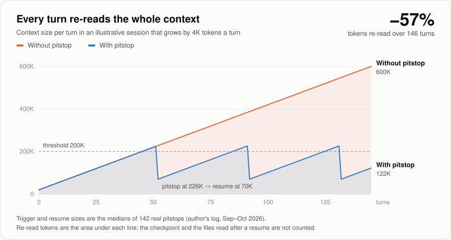

# pitstop

A Claude Code plugin that restarts long sessions from a small checkpoint, so each turn stops re-reading a huge
context.

<picture>
  <source media="(prefers-color-scheme: dark)" srcset="assets/context-dark.svg">
  
</picture>

## Why

Every turn re-reads the whole conversation. Prompt caching makes those reads cheaper, but they are still billed
per token, so a session at 400K tokens pays for 400K tokens on every turn, even when most of it is no longer
needed.

pitstop waits until the context passes a threshold (200K tokens by default), then has Claude write a short
checkpoint at the next clean point: the goal, the current state, the next action, the decisions and preferences,
and the files to re-read. The session restarts from that checkpoint instead of carrying everything along.

The chart above is an illustration, not a benchmark: a 146-turn session that grows by 4K tokens a turn. Its
trigger and resume sizes are the medians of 142 real pitstops from the author's own log (Sep–Oct 2026). The −57%
compares the tokens re-read over the session, the area under each line; it leaves out the checkpoint and the
files re-read after each resume. The saving in your sessions depends on how they grow.

## What a pitstop looks like

1. The context passes the threshold. pitstop asks Claude to stop at the next clean point.
2. Claude writes the checkpoint and prints `🔋 pitstop · done at 226K → back on track with a clean context`.
3. The session restarts:
   - **Terminal:** on a Claude Code that loads hooks modules, pitstop runs `/compact` when the turn ends and
     sends `Resume from the pitstop checkpoint.` by itself. On an older one, you run `/clear` and send any
     message, and the checkpoint is injected into it.
   - **T3 Code and other SDK hosts** (no `/clear` there): Claude queues `/compact` on its own thread, followed by
     `Resume from the pitstop checkpoint.`, so the compacted session picks up by itself.
4. Claude re-reads only the files the next action needs and prints three lines: goal, state, next action.

Claude skips a pitstop when the checkpoint would lose something that lives only in the context: a debugging session
half-way, fine edits on a long text, subagents still running, work that ends in a few exchanges. When in doubt,
it skips.

## Limits

- **A checkpoint can miss things.** Claude writes it, and it points to files instead of copying them. If the
  resumed session lacks something, `/pitstop gap <what was missing>` records it so you can see how often it
  happens.
- **macOS only, so far.** The hooks run `/usr/bin/python3` (3.9+, standard library only) and notifications use
  `osascript`. Linux may work but is untested; Windows is not supported.
- **Built on recent Claude Code.** Checked with 2.1.294. The author's log since September 2026 has 76 resumes after
  `/clear` in the terminal and 35 after `/compact` in T3 Code.

## Install

From GitHub, as a plugin marketplace:

```bash
claude plugin marketplace add 0xCaso/claude-pitstop
claude plugin install pitstop@claude-pitstop
```

Or from a clone, for development (Claude Code loads it as `pitstop@skills-dir`):

```bash
git clone https://github.com/0xCaso/claude-pitstop.git
cd claude-pitstop
mkdir -p ~/.claude/skills && ln -sfn "$PWD" ~/.claude/skills/pitstop
```

Start a new session afterwards. pitstop does not edit your `settings.json`.

## Commands

| Command | Effect |
|---|---|
| `/pitstop status` | On or off, notifications, current context, threshold, pitstops so far, real resume size, gaps |
| `/pitstop on` · `/pitstop off` | Turn pitstop on or off in every session |
| `/pitstop off here` | Turn it off in the current session only |
| `/pitstop now` | Checkpoint and restart right away |
| `/pitstop notify on` · `off` | macOS notifications |
| `/pitstop gap <what was missing>` | Record something a checkpoint missed |

The `/` menu lists the skill as `/pitstop:pitstop`.

To turn the whole plugin off at once: `claude plugin disable pitstop@claude-pitstop` (or `pitstop@skills-dir` for
a clone).

## Configuration

`~/.claude/pitstop/config.json`. A missing file means these defaults:

```json
{
  "enabled": true,
  "notify": true,
  "threshold_tokens": 200000,
  "retrigger_step_tokens": 50000,
  "resume_window_minutes": 60
}
```

| Key | Meaning |
|---|---|
| `threshold_tokens` | Context size that triggers a pitstop (50,000–900,000) |
| `retrigger_step_tokens` | After a skipped pitstop, how many more tokens before asking again |
| `resume_window_minutes` | How long a checkpoint stays valid for an automatic resume (1–60) |

An invalid file turns pitstop off and says why once, until the file changes.

## How it works

- `Stop` and `PostToolBatch` hooks read the context size from the session transcript. Past the threshold they ask
  Claude for a pitstop, once per segment. A context back under the threshold (a `/compact` outside pitstop) starts
  a new segment.
- The `pitstop` skill writes the checkpoint, registers it with the `bin/pitstop` CLI and restarts the session.
- After `/clear`, a `UserPromptSubmit` hook injects the checkpoint into the first message of the new session, once,
  if it is in the same project and within the resume window.
- After `/compact`, a `SessionStart` hook injects the session's own checkpoint, once. It never takes another
  session's checkpoint, and a checkpoint meant for `/compact` never goes to another session. If the user sends a
  new message before the compaction, that checkpoint is dropped: the session went on without it.
- In the terminal and under `claude -p`, the hooks module `hooks/register.ts` sees the end of the turn that registered a checkpoint,
  runs `/compact` and queues the resume message, once per checkpoint. It sets `PITSTOP_AUTO_RESTART=1`, which
  is how `pitstop mark-pending` knows to answer `restart: auto`.
- A `PreToolUse` hook blocks pitstop's `/compact` in T3 Code unless the session has just registered a checkpoint,
  so a skipped pitstop can never compact the conversation.
- A matching checkpoint past the resume window but under 24 hours old is not injected; the new session gets a
  one-line notice with its path instead.
- Every hook fails open: on any error the conversation goes on untouched.

## Data

Everything stays on your machine, in `~/.claude/pitstop/` (override with `PITSTOP_HOME`): `config.json`,
`checkpoints/`, `pending/`, `state/`, `log.jsonl` and `gaps.jsonl`. The log holds token counts and states, not
conversation text. Checkpoints do contain a summary of your session, written without secrets or personal data by
instruction. Checkpoints and session state files older than 30 days are deleted at the next pitstop.

## Development

```bash
/usr/bin/python3 -m unittest discover -s tests -t . -v
claude plugin validate --strict .
claude plugin test .
/usr/bin/python3 assets/make_chart.py assets   # regenerate the chart
```

## Uninstall

```bash
claude plugin uninstall pitstop@claude-pitstop
claude plugin marketplace remove claude-pitstop
```

For a clone: `rm ~/.claude/skills/pitstop`. Delete `~/.claude/pitstop/` too if you do not need the checkpoints or
the log.

## License

[MIT](LICENSE)
